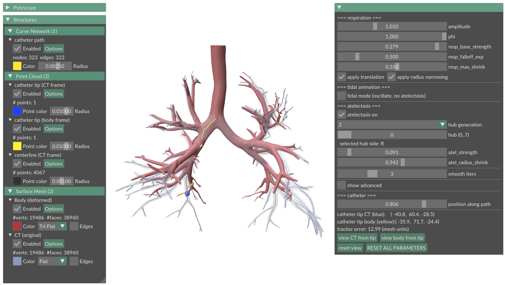

# BronchoDrift



Prototype for a controllable synthetic CT-to-body divergence (CTBD) generator for bronchoscopy navigation (catheter localization), with an interactive viewer for live tuning.

## The problem

Bronchoscopy navigation systems plan a path on a pre-operative CT, but the patient's anatomy drifts during the procedure (respiration, atelectasis under anesthesia, scope-tissue contact). This *CT-to-body divergence* is the dominant source of localization error in current commercial systems — typically ~10–20 mm at peripheral targets. **BronchoDrift generates parameterized synthetic CTBD with ground-truth displacements**, intended as a benchmark / training-data factory for learned trackers and deformation priors.

## Quickstart

All commands assume you are running them from the repo root (`BronchoDrift/`). A virtual environment is recommended.

```bash
python3 -m venv brdr_venv

# Activate (pick the line for your platform):
source brdr_venv/bin/activate       # macOS / Linux
brdr_venv\Scripts\activate          # Windows (cmd.exe / Git Bash)
brdr_venv\Scripts\Activate.ps1      # Windows (PowerShell)
```

```bash
pip install -r requirements.txt
```

The repo provides a pre-built `data/processed/centerline.pkl` corresponding to the original undeformed airways `data/raw/airways_filled.obj`, so you can **jump straight to step 3** to see the demo. Steps 1 and 2 are only needed if you want to rebuild from scratch or use a different input mesh.

```bash
# 1. (optional) Build the centerline graph from the input mesh
python3 -m scripts.01_build_centerline \
    --mesh data/raw/airways_filled.obj \
    --out  data/processed/centerline.pkl \
    --ply  data/processed/centerline.ply

# 2. (optional) Apply a default deformation and write outputs to .ply / .obj
python3 -m scripts.02_apply_deformation \
    --graph data/processed/centerline.pkl \
    --mesh  data/raw/airways_filled.obj \
    --out-graph data/processed/centerline_deformed.ply \
    --out-mesh  data/processed/airway_deformed.obj

# 3. Open the interactive viewer (this is the main demo)
python3 -m scripts.02b_interactive_deformation \
    --graph data/processed/centerline.pkl \
    --mesh  data/raw/airways_filled.obj
```

## Interactive viewer

`02b_interactive_deformation` opens a Polyscope window showing:

- **CT mesh** (translucent blue) and **deformed body mesh** (red), overlaid for direct visual comparison.
- **Centerline + catheter path**: the centerline as small dots (CT-frame), the demo catheter trajectory from root → deepest leaf as a yellow tube (body-frame), and two catheter tip markers: yellow for the body-frame position (where the catheter actually is) and blue for the CT-frame position (where the tracker thinks it is). The yellow-to-blue distance is the live tracker error.

### Controls

| Control | Effect |
|---|---|
| `amplitude`, `phi`, `resp_*` sliders | Respiratory expiratory recoil, calibrated so `amplitude=1.0` gives ~8% SI-extent peak motion at the periphery (literature-realistic) |
| `atel_*` sliders + `hub generation` dropdown + `hub index` slider | Pick which lobar/segmental bronchus collapses; the entire ipsilateral region at-or-below the hub contracts toward it |
| `apply_translation` / `apply_radius` checkboxes | Toggle each effect independently (e.g. show pure bronchiolar lumen narrowing without translation) |
| `tidal mode` + `auto-animate phi` | Switch from one-way drift to oscillating breathing for animation |
| **View CT / view body from tip** buttons | Teleport the camera to the catheter tip looking down the path tangent (bronchoscope-eye view), with the other mesh hidden so the lumen difference reads cleanly |
| **Reset all parameters** button | Restore defaults |

For a non-interactive run, `scripts/02_apply_deformation.py` exposes the same parameters via CLI flags and writes a deformed centerline (`.ply`) and deformed mesh (`.obj`) to disk at `data/processed/`.

## Tunable parameters

All parameters are exposed both through the CLI (`02_apply_deformation`) and as Polyscope sliders (`02b_interactive_deformation`):

| Parameter | Effect | Default |
|---|---|---|
| `amplitude` | Global respiration scale (1.0 = literature-realistic, 0 = off) | `1.0` |
| `phi` | Respiratory phase (0 = CT state, 1 = full deformation) | `1.0` |
| `resp_base_strength` | Peak respiration contraction as fraction of tree distance | `0.08` |
| `resp_falloff_exp` | Motion distribution along the tree (<1 = mid-tree, 1 = linear, >1 = periphery only) | `0.5` |
| `resp_max_shrink` | Peak peripheral lumen narrowing from respiration | `0.25` |
| `atel_hub_gen` + `atel_hub_idx` | Which bronchus is the collapse hub (gen 2 = lobar, gen 4 = sub-segmental) | `3`, `0` |
| `atel_strength` | Contraction fraction toward the hub | `0.4` |
| `atel_falloff_exp` | Falloff shape of the atelectasis contraction (same semantics as `resp_falloff_exp`) | `1.0` |
| `atel_radius_shrink` | Lumen narrowing at the collapse periphery | `0.5` |
| `apply_translation` / `apply_radius` | Toggle each effect independently (e.g. show pure bronchiolar thinning) | both on |
| `mode` | `drift` (one-way CT→body, for benchmarking) or `tidal` (oscillating, for animation) | `drift` |
| `smooth_iters` | Laplacian smoothing of the displacement/scale fields | `3` |
| `gen_exp` *(advanced)* | Generation-weight exponent (higher = upper airways more suppressed) | `1.5` |
| `si_exp` *(advanced)* | SI-position exponent (higher = motion concentrated near the diaphragm) | `2.0` |

## Repo layout

```
BronchoDrift/
├── bronchodrift/
│   ├── __init__.py
│   ├── centerline.py                        # mesh -> voxel skeleton -> rooted networkx tree
│   └── deformation.py                       # respiration + atelectasis -> deformed mesh
├── scripts/
│   ├── 01_build_centerline.py               # CLI: extract centerline from mesh
│   ├── 02_apply_deformation.py              # CLI: apply sample deformation, export to disk
│   └── 02b_interactive_deformation.py       # the main interactive demo
├── data/
│   ├── raw/
│   │   ├── airways_filled.blend             # Blender working file (filled solid)
│   │   ├── airways_filled.obj               # input mesh used by all scripts
│   │   ├── airways_filled.mtl               # OBJ material file for the undeformed mesh
│   │   └── Airways 3D model/                # original Sketchfab download (see inner README)
│   └── processed/
│       ├── centerline.pkl                   # pickled networkx.DiGraph (built by step 1, script 01)
│       ├── centerline.ply                   # centerline as a PLY line-set, colored by generation
│       ├── centerline.png                   # screenshot of the centerline (gen 0 blue -> deepest red)
│       ├── centerline_deformed.ply          # deformed centerline (built by step 2, script 02)
│       ├── airway_deformed.obj              # deformed mesh (built by step 2, script 02)
│       └── material.mtl                     # OBJ material file for the deformed mesh
├── docs/
│   └── BronchoDrift_interface.png
├── requirements.txt
├── .gitignore
└── README.md
```

## How the deformation works (briefly)

One mechanism, two uses: contract a set of nodes toward an anchor along the tree, scaled by tree distance and an optional diaphragm-gradient weight.

- **Respiration** anchors at the carina with the whole sub-carinal tree as scope.
- **Atelectasis** anchors at a chosen lobar/segmental hub with the ipsilateral-and-inferior region as scope.

Per-node displacement and lumen-scale fields are Laplacian-smoothed to avoid bifurcation kinks, then propagated to mesh vertices via inverse-distance-weighted skinning: topology and face connectivity are unchanged, only vertex positions move.

The functional forms (linear normalizations, power-law weights, tree-anchored contractions) are hand-designed parametric building blocks, not biomechanics. Magnitudes are inspired by typical 4D-CT measurements:

| Effect | Approximate magnitude | BronchoDrift default |
|---|---|---|
| Lower-lobe peak respiratory motion | ~15–20 mm superior-inferior (SI) displacement in a ~250 mm lung (vs ~5–10 mm for upper/middle lobes) | `resp_base_strength=0.08` → ~8% of SI extent peak motion at the periphery, with the diaphragm gradient making upper lobes move ~half as much |
| Peripheral airway lumen narrowing (TLC → FRC) | ~15–25% radius reduction at small airways, near-zero at the trachea | `resp_max_shrink=0.25` → up to 25% peripheral radius reduction at `amplitude=1.0` |

The project's role is **not** to be a physical lung model. It's a controllable, parameterized CTBD generator with ground truth, suitable as a benchmark and a training-data factory for learned localization methods.

## Potential future work

- **Naive tracker + benchmark sweep** (nearest-centerline-point localizer; sweep amplitude × atelectasis severity; plot error growth).
- **Learned deformation prior** trained on real 4D-CT data: counterfactual diffusion on CT volumes could be a good fit and would replace the hand-designed parametric form.
- **Synthetic-to-real for visual pose estimation**: render synthetic bronchoscope views from the deformed mesh as training data for video-based catheter pose estimators.

## Attribution

Input mesh: "Anatomy of the airways" by Anna Sieben / E-learning UMCG (University of Groningen), CC BY-NC-SA 4.0, sourced from [Sketchfab](https://sketchfab.com/3d-models/anatomy-of-the-airways-ad7d7e16b98f421db0cda79f265fcc8d). 

The bronchial tree was isolated and filled to a watertight solid in Blender for skeletonization. See `data/raw/Airways 3D model/README.md` for full attribution.
